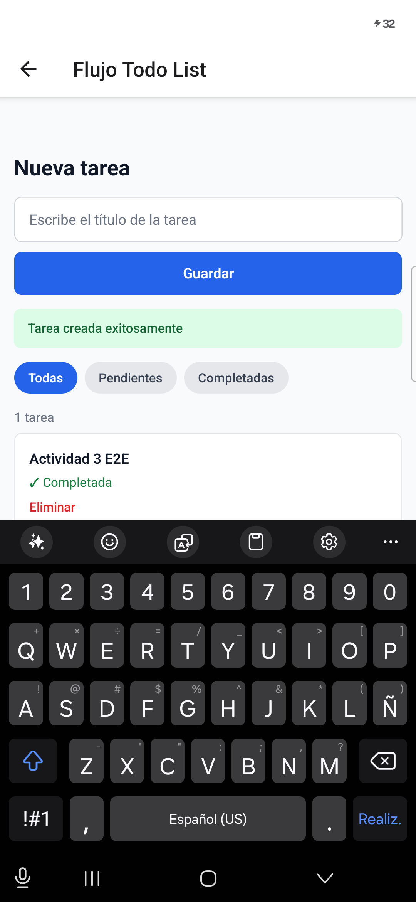
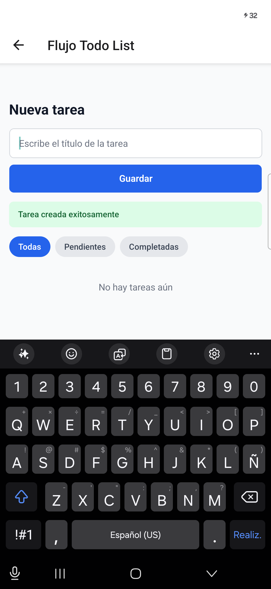

# Actividad 3 - Pruebas de integración, E2E y accesibilidad

## Objetivo

Esta actividad articula componentes, hooks y servicios en pruebas de integración, automatiza un recorrido completo con Maestro y verifica propiedades de accesibilidad. El trabajo se realizó sobre la base entregada por el docente, conservando las pruebas y los flujos existentes.

## Cambios realizados

- Se conectó opcionalmente `CreateTaskScreen` con `taskService` mediante `useCreateTask` para probar la integración HTTP sin reemplazar componentes ni hooks.
- Se añadieron estados visibles y accesibles de carga, éxito y error.
- Se ampliaron los casos de `CreateTaskScreen` a 5 escenarios de integración real con MSW y gestión completa de tareas.
- Se agregaron 3 pruebas de `HomeScreen` para validar contenido y navegación real con Expo Router.
- Se agregaron 2 pruebas de accesibilidad para `TaskForm`.
- Se configuró `eslint-plugin-jsx-a11y` para analizar `TaskForm` y `TaskCard`.
- Se creó un flujo propio de Maestro para crear, completar y eliminar una tarea.
- Se configuró un perfil EAS `preview` para generar una APK instalable en Android.
- Se mejoraron etiquetas, roles y contraste de color.

La aplicación conserva el funcionamiento local y persistente por defecto. La opción `syncWithApi` se activa en las pruebas de integración para recorrer la capa HTTP completa sin hacer que la aplicación dependa del servicio simulado fuera de Jest.

## 1. Pruebas de integración con MSW

Archivo: [`__tests__/integration/CreateTaskScreen.test.tsx`](../__tests__/integration/CreateTaskScreen.test.tsx).

Las pruebas renderizan la pantalla completa y permiten la interacción real entre:

```text
CreateTaskScreen → TaskForm → useCreateTask → taskService → MSW
                                      ↓
                              TaskList y mensajes
```

No se simulan `TaskForm`, `TaskList`, `useCreateTask` ni `taskService`. MSW se usa únicamente en el límite externo para interceptar `GET /tasks` y `POST /tasks`.

### Escenario de éxito

1. MSW responde inicialmente con una lista vacía.
2. El usuario escribe un título y presiona **Guardar**.
3. `useCreateTask` llama a `createTask`.
4. MSW devuelve la tarea creada con estado HTTP 201.
5. La pantalla muestra la confirmación y la nueva tarea.

### Escenario de error de API

1. La prueba sustituye selectivamente el handler de `POST /tasks`.
2. MSW responde con estado HTTP 500.
3. La pantalla muestra `No fue posible crear la tarea`.
4. La tarea rechazada no aparece en la lista.

### Escenario de datos vacíos

1. MSW devuelve `[]` en `GET /tasks`.
2. Finaliza el estado de carga.
3. La pantalla muestra `No hay tareas aún`.

### Escenarios complementarios

También se verificó el comportamiento de la pantalla cuando falla el `GET /tasks` inicial. La interfaz abandona el estado de carga y presenta `No fue posible cargar las tareas`.

Un quinto caso carga dos tareas desde MSW y recorre las funciones que faltaban en el reporte de cobertura:

- Marcar una tarea como completada.
- Alternar entre los filtros **Todas**, **Pendientes** y **Completadas**.
- Abrir el diálogo de eliminación y cancelar la acción.
- Abrir nuevamente el diálogo y confirmar la eliminación.

Para `HomeScreen` se añadió [`__tests__/integration/HomeScreen.test.tsx`](../__tests__/integration/HomeScreen.test.tsx). Estas pruebas comprueban los dos accesos visibles y navegan realmente a `/todo` y `/checkout` mediante las utilidades de prueba de Expo Router.

La infraestructura compartida se encuentra en [`src/mocks`](../src/mocks) y se inicializa desde [`jest.setup.js`](../jest.setup.js). Después de cada prueba se restauran los handlers para evitar contaminación entre escenarios.

## 2. Flujo E2E con Maestro

Archivo creado: [`.maestro/actividad_3_tareas.yaml`](../.maestro/actividad_3_tareas.yaml).

El flujo automatiza este recorrido:

1. Reiniciar y abrir la aplicación.
2. Entrar a **Flujo Todo List**.
3. Escribir y guardar `Actividad 3 E2E`.
4. Verificar la confirmación y la tarea visible.
5. Marcar la tarea como completada.
6. Guardar una captura de evidencia.
7. Eliminar la tarea mediante el diálogo de confirmación.
8. Verificar que ya no esté visible y guardar una captura final.

El archivo fue validado sintácticamente como YAML y se ejecutó sobre un celular Android conectado mediante ADB. La aplicación se generó como una APK independiente con el perfil `preview` de [`eas.json`](../eas.json), por lo que la prueba no dependió de Expo Go.

### Preparación y ejecución en el celular

La prueba se realizó sobre un **Samsung Galaxy S26 Ultra con Android 16**. No se utilizó un emulador y tampoco fue necesario abrir la aplicación mediante Expo Go. El procedimiento aplicado fue el siguiente:

1. Se descargaron las herramientas **Android SDK Platform Tools** para disponer del comando `adb` en Windows.
2. Se instaló Maestro CLI y se comprobó su funcionamiento con `maestro --version`. La versión utilizada fue Maestro 2.8.0.
3. En el celular se habilitaron las **Opciones de desarrollador** y la **Depuración por USB**.
4. El Samsung Galaxy S26 Ultra se conectó al computador mediante cable USB y se autorizó la depuración desde el mensaje mostrado por Android.
5. Se verificó que el computador reconociera correctamente el dispositivo:

   ```powershell
   adb devices
   ```

   El celular apareció con el estado `device`, lo que confirmó que Maestro podía controlarlo mediante ADB.

6. Se configuró [`eas.json`](../eas.json) con el perfil `preview` y `android.buildType: "apk"` para producir un archivo instalable directamente en el teléfono.
7. Se inició sesión en Expo y se generó la APK mediante EAS Build:

   ```powershell
   npx eas-cli@latest login
   npx eas-cli@latest build --platform android --profile preview
   ```

8. Al finalizar la compilación, se abrió en el celular el enlace proporcionado por EAS, se descargó la APK y se autorizó su instalación.
9. Se verificó mediante ADB que la aplicación estuviera instalada con el identificador esperado:

   ```powershell
   adb shell pm list packages | Select-String "com.taskmanager.app"
   ```

   La comprobación devolvió `package:com.taskmanager.app`.

10. Con el celular conectado, desbloqueado y la APK instalada, se ejecutó el flujo desde la raíz del repositorio:

    ```powershell
    maestro test .maestro/actividad_3_tareas.yaml --test-output-dir docs/evidencias
    ```

11. El flujo se repitió una segunda vez para confirmar que el resultado fuera reproducible. Las dos ejecuciones finalizaron satisfactoriamente y generaron cuatro capturas en total.

La APK `preview` contenía el código de la aplicación, de modo que durante las pruebas no fue necesario mantener `npm start` en ejecución. Maestro abrió y controló directamente `com.taskmanager.app` desde el celular físico.

Antes de construir la APK se alinearon `react`, `react-dom`, `react-native-web` y `test-renderer` con Expo SDK 54. Esto permitió que el mismo comando `npm ci --include=dev` utilizado por EAS instalara las dependencias correctamente.

### Resultado de las ejecuciones

El flujo se ejecutó satisfactoriamente dos veces el 5 de agosto de 2026. En ambas ejecuciones, Maestro completó todos los comandos y produjo las dos capturas configuradas.

| Ejecución | Inicio aproximado | Resultado | Evidencias |
|---|---|---|---|
| 1 | 21:38 | Satisfactoria | [Tarea completada](evidencias/2026-08-05_213809/actividad_3_tareas/takeScreenshot/actividad-3-tarea-completada.png) · [Flujo finalizado](evidencias/2026-08-05_213809/actividad_3_tareas/takeScreenshot/actividad-3-flujo-finalizado.png) · [Registro](evidencias/2026-08-05_213809/actividad_3_tareas/logs/maestro.log) |
| 2 | 21:39 | Satisfactoria | [Tarea completada](evidencias/2026-08-05_213914/actividad_3_tareas/takeScreenshot/actividad-3-tarea-completada.png) · [Flujo finalizado](evidencias/2026-08-05_213914/actividad_3_tareas/takeScreenshot/actividad-3-flujo-finalizado.png) · [Registro](evidencias/2026-08-05_213914/actividad_3_tareas/logs/maestro.log) |

La primera captura demuestra que la tarea fue creada, aparece en la lista y cambió al estado **Completada**. La segunda demuestra que, después de confirmar la eliminación, la interfaz volvió al estado vacío `No hay tareas aún`.

#### Evidencia visual de la segunda ejecución





El inventario completo de artefactos está en [`docs/evidencias/README.md`](evidencias/README.md).

## 3. Verificaciones de accesibilidad

### ESLint

Se instalaron `eslint`, `@typescript-eslint/parser` y `eslint-plugin-jsx-a11y`. La configuración de [`.eslintrc.cjs`](../.eslintrc.cjs) mapea `Pressable` y `TextInput` a elementos interactivos equivalentes para que el plugin pueda analizarlos.

El comando revisa exactamente los dos componentes solicitados:

```powershell
npm run lint:a11y
```

Componentes analizados:

- [`src/components/TaskForm.tsx`](../src/components/TaskForm.tsx)
- [`src/components/TaskCard.tsx`](../src/components/TaskCard.tsx)

Resultado final: **0 errores y 0 advertencias**.

Hallazgos durante la revisión:

- El botón **Guardar** dependía únicamente de su texto visible y no tenía `accessibilityLabel` explícito.
- El campo del título tenía nombre accesible, pero no explicaba qué dato debía ingresar el usuario.
- Los mensajes de carga, éxito y error no estaban marcados como alertas para tecnologías de asistencia.
- El gris anterior del placeholder (`#9ca3af`) ofrecía poco contraste sobre fondo blanco.
- El verde usado para una tarea completada era claro para texto pequeño.

`eslint-plugin-jsx-a11y` está orientado principalmente a HTML. El mapeo permite usarlo como comprobación estática complementaria en React Native, pero no calcula contraste ni sustituye las pruebas manuales con VoiceOver o TalkBack.

### Pruebas con jest-native

Archivo agregado: [`__tests__/accessibility/TaskForm.a11y.test.tsx`](../__tests__/accessibility/TaskForm.a11y.test.tsx).

Los dos casos verifican que:

- El campo de título tenga nombre, ayuda accesible y esté habilitado. Se conserva la semántica nativa de `TextInput`.
- El botón para guardar pueda localizarse por rol y nombre accesible, y esté habilitado.

Los matchers están disponibles mediante `@testing-library/jest-native/extend-expect` en [`jest.setup.js`](../jest.setup.js). También se conservaron las pruebas de accesibilidad de `TaskCard` incluidas en la base.

## 4. Mejoras de accesibilidad aplicadas

1. Se agregaron un nombre descriptivo al botón y ayudas con `accessibilityHint` para el campo y la acción de guardar.
2. Los mensajes de carga, confirmación y error ahora utilizan `accessibilityRole="alert"` para que puedan anunciarse.
3. El placeholder cambió de `#9ca3af` a `#6b7280`, un gris más oscuro sobre fondo blanco.
4. El estado completado cambió de `text-green-600` a `text-green-700` para mejorar la legibilidad del texto pequeño.

Como validación manual posterior se propone recorrer toda la aplicación con TalkBack en Android y VoiceOver en iOS, comprobando el orden de foco, el anuncio de los diálogos y el comportamiento del teclado.

## 5. Resultados

Comandos ejecutados:

```powershell
npm test -- --runInBand
npm run test:coverage -- --runInBand
npm run lint:a11y
npx tsc --noEmit
```

Resultado de Jest:

```text
Test Suites: 21 passed, 21 total
Tests:       108 passed, 108 total
Snapshots:   0 total
```

Cobertura global:

| Indicador | Resultado |
|---|---:|
| Statements | 98.41 % |
| Branches | 92.30 % |
| Functions | 93.90 % |
| Lines | 99.38 % |

Cobertura específica de las pantallas mejoradas:

| Pantalla | Statements | Branches | Functions | Lines |
|---|---:|---:|---:|---:|
| `CreateTaskScreen.tsx` | 100 % | 85.71 % | 100 % | 100 % |
| `HomeScreen.tsx` | 100 % | 100 % | 100 % | 100 % |

### Adicional: mejora de cobertura en las pantallas

Después de completar los requisitos principales de la actividad se revisó el reporte HTML de Jest. Se encontró que `CreateTaskScreen` tenía una cobertura baja y que `HomeScreen` no estaba siendo ejecutada por ninguna prueba. Para corregirlo se agregaron 5 casos adicionales: 2 para ampliar los flujos de `CreateTaskScreen` y 3 para comprobar el contenido y la navegación de `HomeScreen`.

#### Comparación por pantalla

| Pantalla | Indicador | Antes | Después | Diferencia |
|---|---|---:|---:|---:|
| `CreateTaskScreen.tsx` | Statements | 68.75 % | 100 % | +31.25 puntos |
| `CreateTaskScreen.tsx` | Branches | 78.57 % | 85.71 % | +7.14 puntos |
| `CreateTaskScreen.tsx` | Functions | 50 % | 100 % | +50 puntos |
| `CreateTaskScreen.tsx` | Lines | 71.42 % | 100 % | +28.58 puntos |
| `HomeScreen.tsx` | Statements | 0 % | 100 % | +100 puntos |
| `HomeScreen.tsx` | Branches | 100 %* | 100 % | Sin cambio |
| `HomeScreen.tsx` | Functions | 0 % | 100 % | +100 puntos |
| `HomeScreen.tsx` | Lines | 0 % | 100 % | +100 puntos |

\* El 100 % inicial de branches en `HomeScreen` no indicaba que la pantalla estuviera probada. Jest mostraba ese valor porque el archivo no tenía ramas contabilizadas; statements, functions y lines permanecían en 0 %.

#### Comparación global

| Indicador | Antes | Después | Diferencia |
|---|---:|---:|---:|
| Suites aprobadas | 20 | 21 | +1 |
| Pruebas aprobadas | 103 | 108 | +5 |
| Statements | 91.53 % | 98.41 % | +6.88 puntos |
| Branches | 89.42 % | 92.30 % | +2.88 puntos |
| Functions | 85.36 % | 93.90 % | +8.54 puntos |
| Lines | 91.97 % | 99.38 % | +7.41 puntos |

Los nuevos casos cubrieron el error de carga inicial, el cambio de estado, los filtros y la cancelación y confirmación de una eliminación. En `HomeScreen` se verificaron los textos, nombres accesibles y la navegación real hacia `/todo` y `/checkout` mediante Expo Router.

TypeScript finalizó sin errores y el análisis de accesibilidad terminó sin advertencias.

Resultado E2E:

```text
Ejecuciones de Maestro: 2
Ejecuciones aprobadas:  2
Capturas generadas:     4
```

## Referencias

- [Expo SDK 54](https://docs.expo.dev/versions/v54.0.0/)
- [Mock Service Worker](https://mswjs.io/docs/getting-started)
- [Maestro](https://docs.maestro.dev/get-started/quickstart)
- [React Native Testing Library](https://callstack.github.io/react-native-testing-library/docs/api)
- [jest-native](https://github.com/testing-library/jest-native)
- [eslint-plugin-jsx-a11y](https://github.com/jsx-eslint/eslint-plugin-jsx-a11y)

[Volver al README](../README.md)
