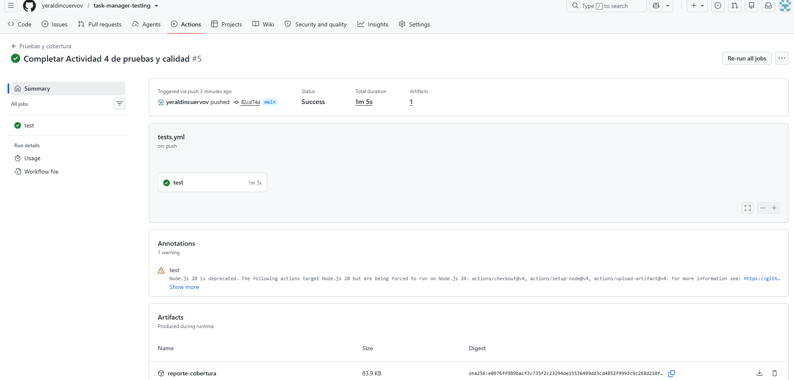
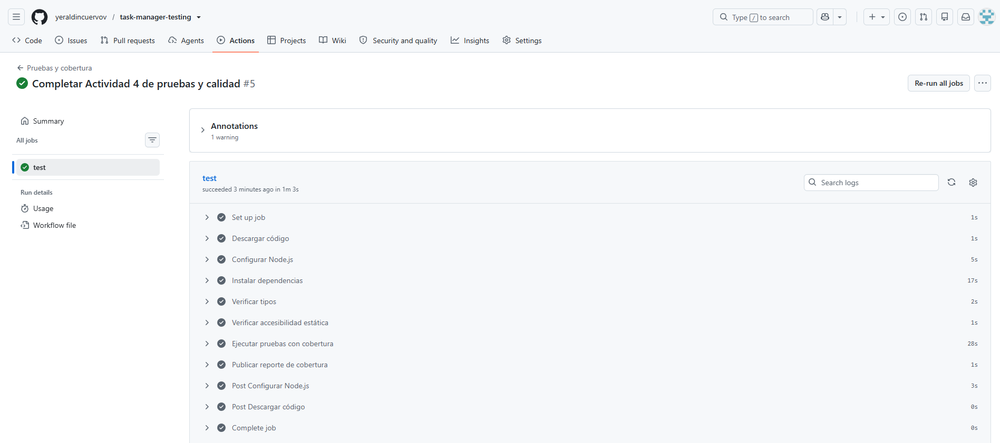
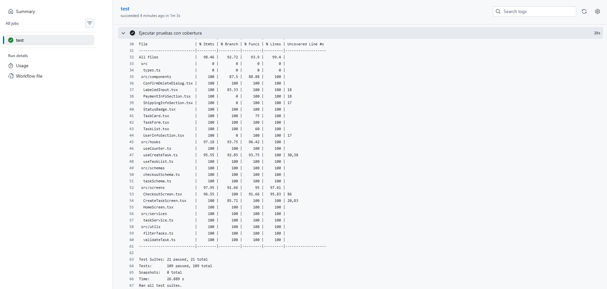

# Evidencias de la Actividad 4

Esta carpeta reúne los resultados reproducibles del análisis realizado el 20 de agosto de 2026 sobre un Pixel 10 virtual con Android 16/API 36.

- [`rendimiento.json`](rendimiento.json): 155 muestras de Flashlight distribuidas en 5 iteraciones satisfactorias.
- [`arranque-en-frio.txt`](arranque-en-frio.txt): resultado de 5 inicios en frío mediante Android Activity Manager.
- [`pipeline-exitoso-summary.png`](pipeline-exitoso-summary.png): resumen de GitHub Actions con estado **Success**, duración total de 1 min 5 s y el artefacto `reporte-cobertura` generado.
- [`pipeline-exitoso-steps.png`](pipeline-exitoso-steps.png): evidencia de todos los pasos aprobados, incluyendo instalación, TypeScript, accesibilidad, pruebas y publicación de cobertura.
- [`pipeline-exitoso-step-test-coverage.png`](pipeline-exitoso-step-test-coverage.png): detalle de Jest con 21 suites, 109 pruebas aprobadas y el reporte de cobertura global.

## Evidencia de GitHub Actions

La ejecución `Completar Actividad 4 de pruebas y calidad #5` fue activada mediante un `push` a la rama `main`. El job `test` finalizó satisfactoriamente y publicó el reporte de cobertura como artefacto descargable.

GitHub mostró una advertencia informativa sobre la actualización del runtime interno de algunas Actions desde Node.js 20 a Node.js 24. Esta advertencia no corresponde a una falla del proyecto: el job y todos sus pasos finalizaron correctamente.

### Resumen exitoso

### Pasos ejecutados

### Pruebas y cobertura

Los valores consolidados y su interpretación están en [`docs/ACTIVIDAD-4.md`](../../ACTIVIDAD-4.md).
